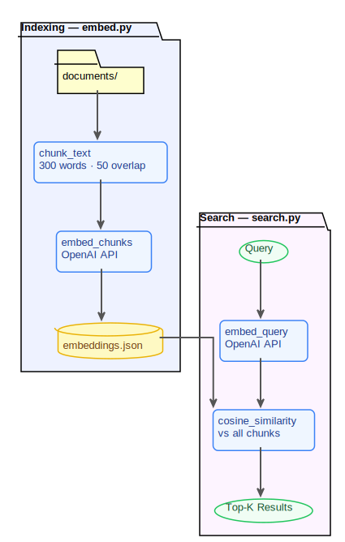
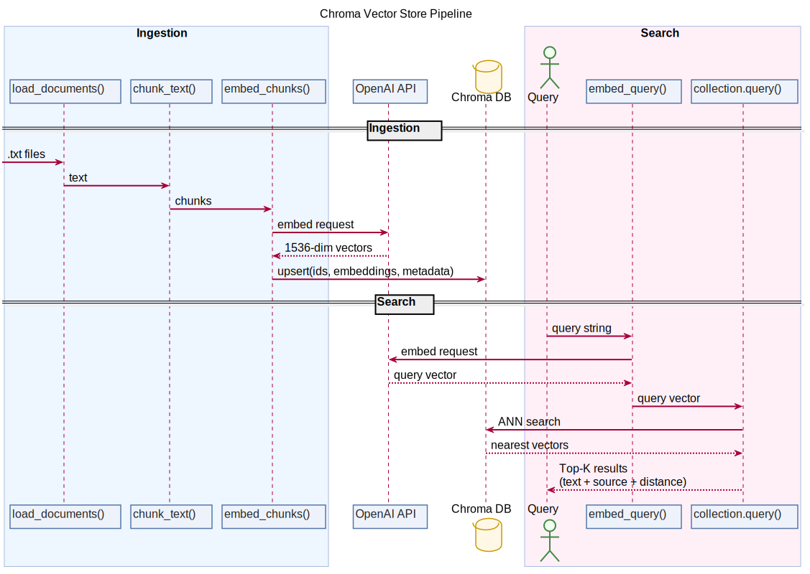
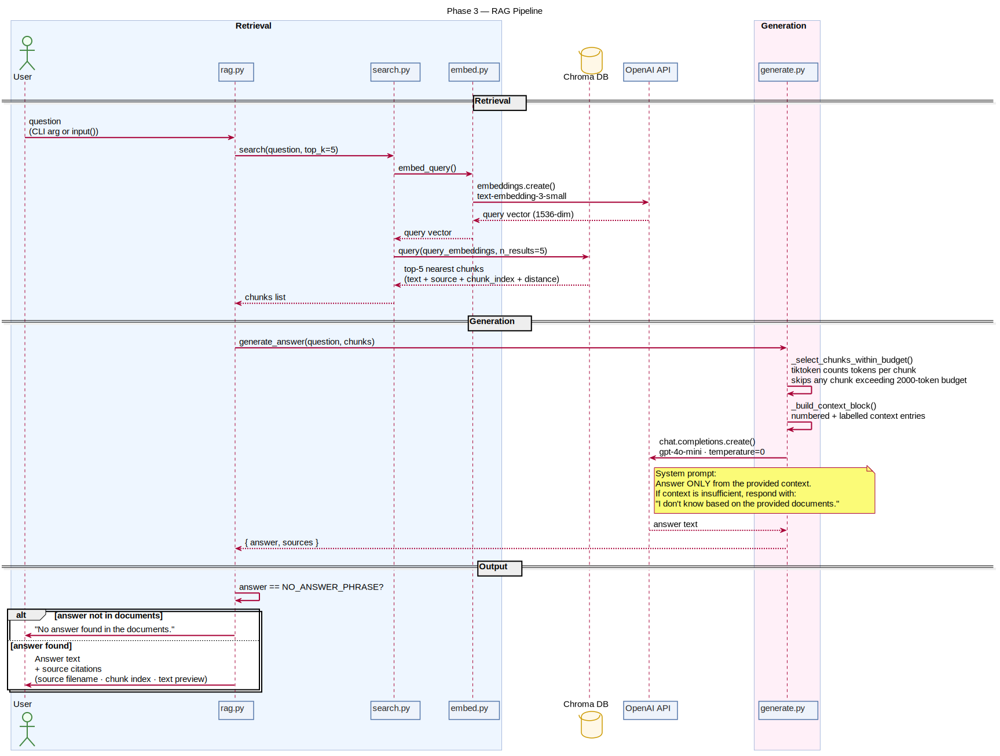
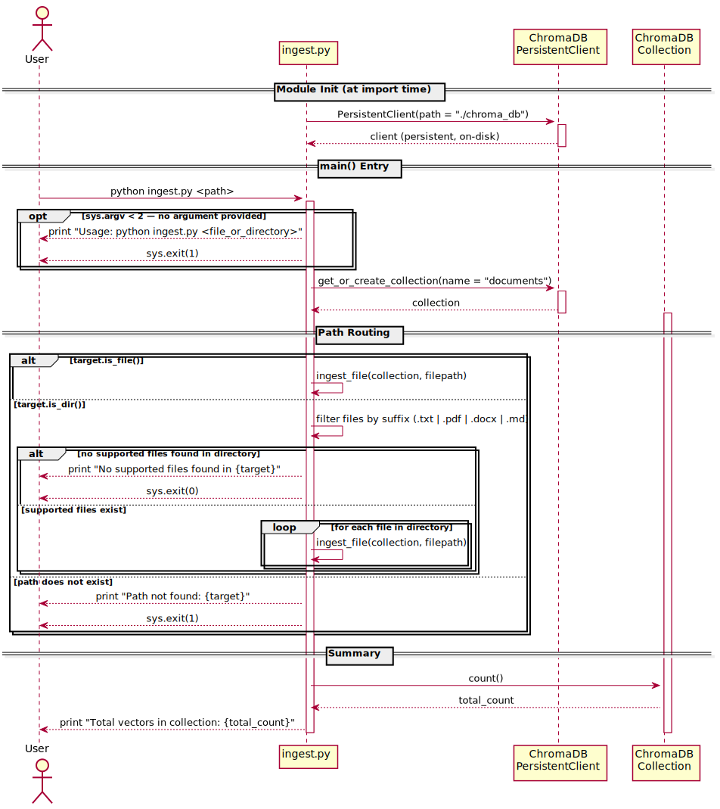
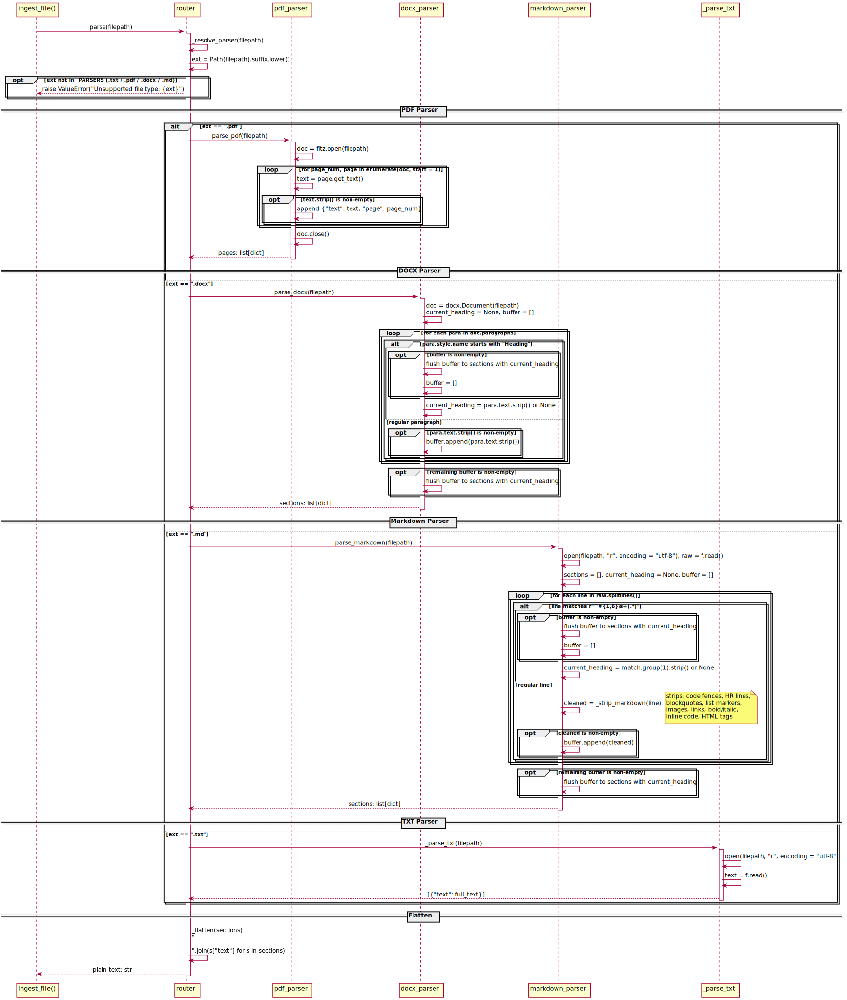
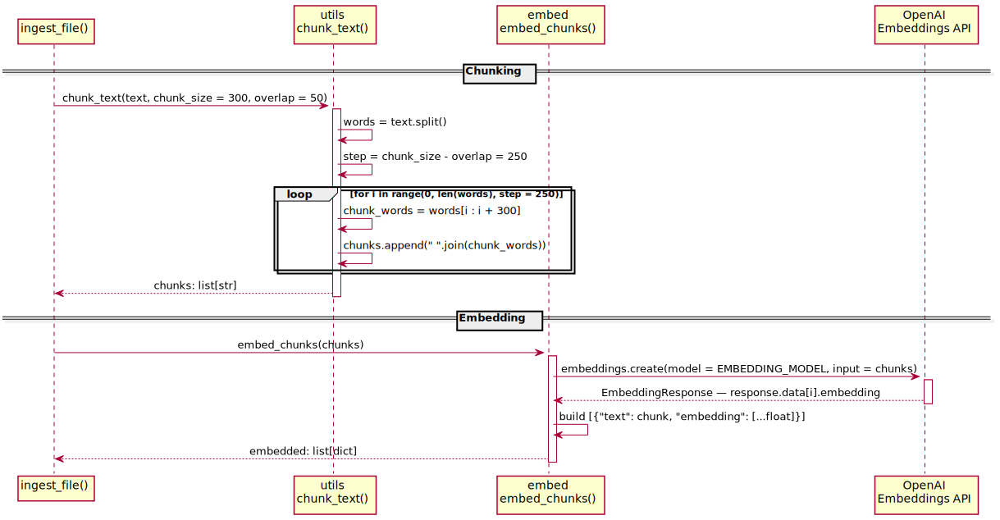
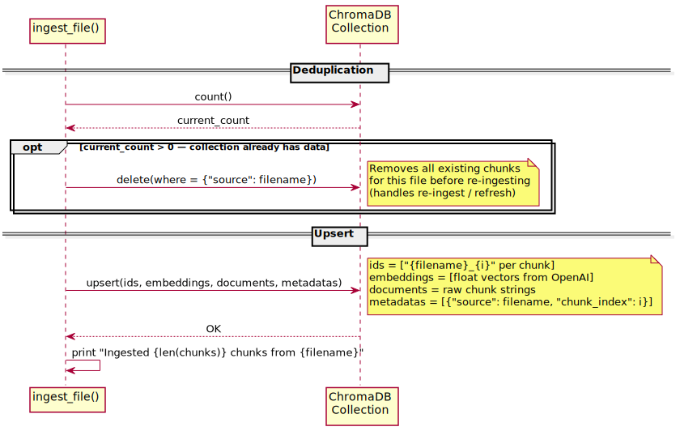
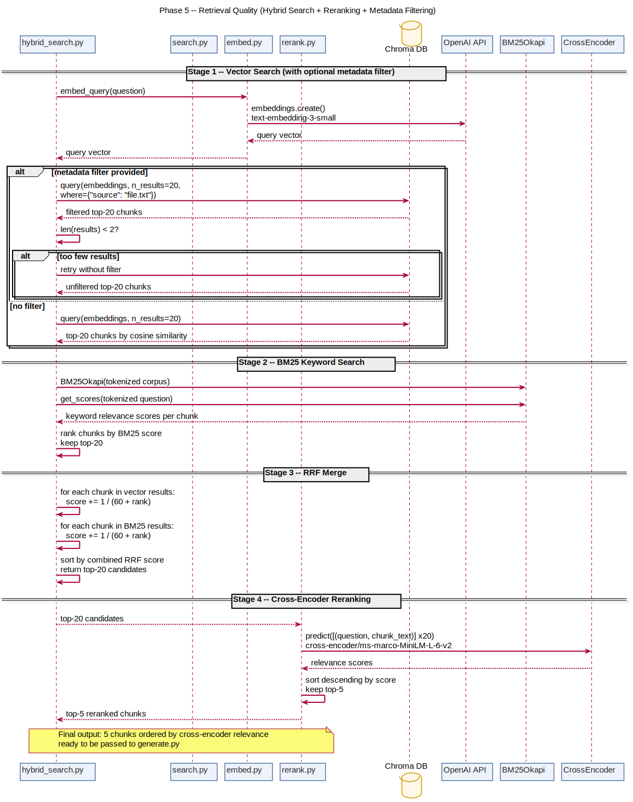

# RAG Document Engine

A progressive RAG system built from first principles -- from raw embeddings and cosine similarity all the way to a full retrieval-augmented generation pipeline with multi-format document ingestion and cited answers.

---

## What It Does (Current State)

### Ingestion

1. **Parses** `.txt`, `.pdf`, `.docx`, and `.md` files into plain text via format-specific parsers
2. **Chunks** each document into overlapping word windows
3. **Embeds** each chunk using OpenAI `text-embedding-3-small`, producing a 1536-dimensional vector
4. **Deduplicates** - deletes any existing chunks for the file before storing, so re-ingestion replaces rather than duplicates
5. **Stores** vectors with metadata (`source`, `chunk_index`) in a persistent Chroma collection

### Search

1. **Embeds** the query using the same model
2. **Runs hybrid search** -- vector search via Chroma ANN and BM25 keyword search in parallel
3. **Merges** both ranked lists using Reciprocal Rank Fusion (RRF, k=60)
4. **Reranks** the merged candidates using a cross-encoder (`cross-encoder/ms-marco-MiniLM-L-6-v2`) for precise relevance scoring
5. **Supports metadata filtering** -- optional `filters` dict narrows search to specific source files before retrieval, with automatic fallback to unfiltered if results are too few
6. **Returns** top-5 reranked chunks with text, source filename, and chunk index

### Generation

1. **Selects** retrieved chunks within a 2000-token budget using `tiktoken`
2. **Builds** a numbered context block from the selected chunks
3. **Calls** `gpt-4o-mini` with a grounding system prompt that enforces context-only answers
4. **Returns** a grounded answer with source citations, or a clean no-answer message when context is insufficient

---

## Stack

- Python 3.12
- OpenAI SDK (`text-embedding-3-small` for embeddings, `gpt-4o-mini` for generation)
- Chroma (persistent vector database)
- tiktoken (token counting for context budget management)
- pymupdf (PDF parsing)
- python-docx (DOCX parsing)
- numpy (cosine similarity computation)
- rank-bm25 (BM25 keyword search)
- sentence-transformers (cross-encoder reranking)
- python-dotenv

---

## Project Structure

```text
rag-document-engine/
├── documents/                  # Sample documents (.txt, .pdf, .docx, .md)
├── ingest/                     # Format-specific parsers (Phase 4)
│   ├── __init__.py
│   ├── router.py               # Resolves parser by file extension
│   ├── pdf_parser.py           # PDF extraction via pymupdf
│   ├── docx_parser.py          # DOCX extraction via python-docx
│   └── markdown_parser.py      # Markdown stripping to plain text
├── prompts/
│   └── system_prompt.txt       # LLM system prompt (loaded at runtime)
├── embed.py                    # embed_chunks and embed_query utilities
├── ingest.py                   # CLI entry point - parse, chunk, embed, store
├── search.py                   # Embed query + retrieve top-K from Chroma (with optional metadata filter)
├── hybrid_search.py            # BM25 + vector search merged via RRF
├── rerank.py                   # Cross-encoder reranker on top of hybrid search candidates
├── generate.py                 # Token-budgeted answer generation via gpt-4o-mini
├── rag.py                      # End-to-end pipeline entry point
├── config.py                   # Tuneable constants (chunk size, reranker K, RRF K)
├── inspect_collection.py       # Print collection stats and a sample entry
├── utils.py                    # chunk_text, load_document, load_documents
├── eval/
│   ├── golden_dataset.json     # 20 manually written Q&A pairs for evaluation
│   ├── eval.py                 # Evaluation harness -- retrieval recall + LLM-as-judge scoring
│   └── results.md              # Raw eval output and observations per experiment
├── chroma_db/                  # Chroma persistent storage (not committed)
├── diagrams/                   # Pipeline diagrams (SVG, generated via npx diagram-sync)
├── docs/                       # Phase notes, PlantUML source files, and docs index
├── pyproject.toml
└── .env                        # API keys (not committed)
```

---

## Setup

```bash
python3 -m venv .venv
source .venv/bin/activate
pip install -e .
```

Create a `.env` file:

```env
OPENAI_API_KEY=sk-...
EMBEDDING_MODEL=text-embedding-3-small
GENERATION_MODEL=gpt-4o-mini
TOKEN_BUDGET=2000
```

---

## Usage

```bash
# Step 1 -- Ingest a single file or an entire directory
python3 ingest.py documents/ancient-rome.pdf
python3 ingest.py documents/

# Step 2 -- Ask a question (full RAG pipeline)
python3 rag.py "what foods are good for the heart"

# Or run interactively
python3 rag.py

# Search only (returns raw chunks, no generation)
python3 search.py

# Inspect the collection
python3 inspect_collection.py
```

---

## Sample Output

**RAG pipeline** -- `python3 rag.py "what foods are good for the heart"`

```text
Answer:
Foods that are good for the heart include those rich in unsaturated fats, such as olive oil,
nuts, avocados, and fatty fish. The Mediterranean diet -- rich in vegetables, fruit, whole
grains, fish, and olive oil -- is consistently associated with lower rates of heart disease.

Sources:
  [1] nutrition-and-health.txt (chunk 0): "Nutrition is the science of how food affects the body..."
  [2] nutrition-and-health.txt (chunk 1): "The Mediterranean diet -- rich in vegetables, fruit, whole grains..."
```

**No-answer path** -- `python3 rag.py "what is the capital of France"`

```text
No answer found in the documents.
```

**Search only** -- `python3 search.py`

```text
Result 1 (distance: 1.2862) - nutrition-and-health.txt [chunk 0]
Nutrition is the science of how food affects the body... Unsaturated fats found in olive oil,
nuts, avocados, and fatty fish are associated with reduced risk of heart disease...

Result 2 (distance: 1.3720) - nutrition-and-health.txt [chunk 1]
The Mediterranean diet -- rich in vegetables, fruit, whole grains, fish, and olive oil -- is
consistently associated with lower rates of heart disease, diabetes, and cognitive decline...

Result 3 (distance: 1.6426) - music-and-the-brain.txt [chunk 1]
Music also affects mood and stress. Slow, quiet music activates the parasympathetic nervous
system, lowering heart rate and cortisol levels...
```

The top two results come from the nutrition document. Result 3 surfaces from the music document because it mentions "heart rate" -- semantic search catches conceptual overlap, not just keyword matches.

Note: distance is an inverse similarity score -- lower means more relevant.

---

## Progress

| Phase | Title | Status |
| ----: | ----- | ------ |
| 1 | Semantic Foundation | Complete |
| 2 | Vector Store | Complete |
| 3 | RAG Pipeline | Complete |
| 4 | Document Ingestion | Complete |
| 5 | Retrieval Quality | Complete |
| 6 | Search and Chat Mode | Planned |
| 7 | Role-Based Document Access | Planned |

See [docs/implementation-plan.md](./docs/implementation-plan.md) for full phase details, tasks, and build notes.

---

## Key Concepts

- **Embeddings** -- fixed-length vectors that encode the meaning of text, not just the words
- **Cosine similarity** -- measures the angle between vectors; direction encodes meaning, magnitude does not
- **Chunking** -- splits documents into overlapping windows so meaning is not diluted or cut at boundaries
- **Model consistency** -- the same embedding model must be used for both documents and queries
- **Vector database** -- stores embeddings with metadata and retrieves them by similarity using ANN search
- **RAG** -- Retrieval-Augmented Generation: retrieve relevant context, then generate a grounded answer
- **Document parsing** -- format-specific extraction that converts PDF, DOCX, and Markdown into plain text before chunking; all formats share the same embedding and storage flow after parsing
- **Hybrid search** -- combines vector similarity (semantic) and BM25 (keyword) rankings; catches cases where exact terms matter that embeddings miss
- **Reciprocal Rank Fusion** -- merges two ranked lists by summing 1/(k+rank) per item; chunks that rank high in both lists score highest
- **Cross-encoder reranking** -- reads query and chunk together to score direct relevance; more accurate than cosine similarity, used as a second pass on a small candidate set

---

## Diagrams

Pipeline diagrams are maintained as PlantUML source files in `docs/` and exported to SVG via `npx diagram-sync` using [diagram-sync](https://www.npmjs.com/package/diagram-sync).

The diagrams below show the system growing phase by phase -- each one builds on the previous.

### Phase 1 -- Semantic Search (cosine similarity over JSON embeddings)



### Phase 2 -- Vector Store (Chroma replaces the JSON store)



### Phase 3 -- RAG Pipeline (generation on top of retrieval)



### Phase 4 -- Document Ingestion (multi-format parsing, deduplication)

The ingestion flow is split into 4 focused diagrams - read in this order:

**1. Entry and Routing** - CLI validation, collection setup, file vs directory routing



**2. Parsing** - router extension resolution, all 4 parsers (PDF / DOCX / MD / TXT), flatten to plain text



**3. Chunking and Embedding** - sliding window chunking, OpenAI embeddings API call



**4. Upsert** - deduplication check, ChromaDB upsert with full payload



### Phase 5 -- Retrieval Quality (hybrid search, reranking, metadata filtering)


