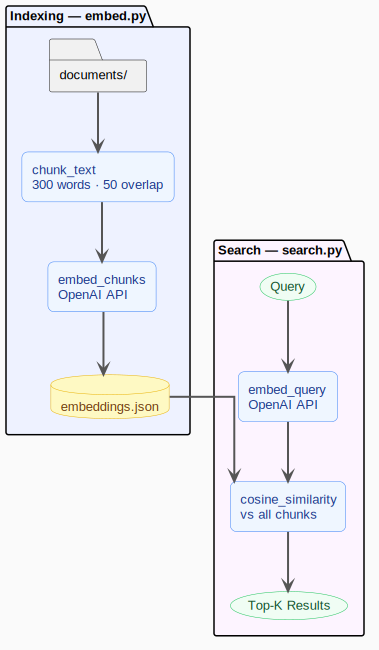

# RAG Document Engine

A progressive RAG system built from first principles -- from raw embeddings and cosine similarity all the way to a full retrieval-augmented generation pipeline with document ingestion, reranking, and cited answers.

---

## What It Does (Current State)

<table>
<tr>
<td valign="top" width="55%">

Ingestion

1. **Loads** `.txt` files (PDF, DOCX, Markdown from Phase 4)
2. **Chunks** each document into overlapping word windows
3. **Embeds** each chunk using OpenAI `text-embedding-3-small`, producing a 1536-dimensional vector
4. **Stores** vectors with metadata (`source`, `chunk_index`) in a persistent Chroma collection

Search

1. **Embeds** the query using the same model
2. **Queries** Chroma for the top-K nearest vectors using built-in ANN (Approximate Nearest Neighbor) search
3. **Returns** results with chunk text, source filename, and distance score

</td>
<td valign="top" width="45%">



</td>
</tr>
</table>

---

## Stack

- Python 3.12
- OpenAI SDK (`text-embedding-3-small`)
- Chroma (persistent vector database)
- python-dotenv

---

## Project Structure

```text
rag-document-engine/
├── documents/                  # Sample .txt files
│   ├── ancient-rome.txt
│   ├── climate-change.txt
│   ├── music-and-the-brain.txt
│   ├── nutrition-and-health.txt
│   └── space-exploration.txt
├── embed.py                    # embed_chunks and embed_query utilities
├── ingest.py                   # Load, chunk, embed, store in Chroma
├── search.py                   # Embed query + retrieve top-K from Chroma
├── inspect_collection.py       # Print collection stats and a sample entry
├── utils.py                    # chunk_text, load_document, load_documents
├── chroma_db/                  # Chroma persistent storage (not committed)
├── diagrams/                   # Pipeline diagrams
├── docs/
│   └── implementation-plan.md  # Phase-by-phase build plan
├── pyproject.toml
└── .env                        # API keys (not committed)
```

---

## Setup

```bash
python3 -m venv .venv
source .venv/bin/activate
pip install -e .
```

Create a `.env` file:

```env
OPENAI_API_KEY=sk-...
EMBEDDING_MODEL=text-embedding-3-small
```

---

## Usage

```bash
# Step 1 -- Ingest documents into Chroma
python3 ingest.py

# Step 2 -- Search
python3 search.py

# Inspect the collection
python3 inspect_collection.py
```

The query is set in `search.py` main. Change it to anything you want to search for.

---

## Sample Output

Query: `"what foods are good for the heart"`

```text
Result 1 (distance: 1.2862) -- nutrition-and-health.txt [chunk 0]
Nutrition is the science of how food affects the body... Unsaturated fats found in olive oil,
nuts, avocados, and fatty fish are associated with reduced risk of heart disease...

Result 2 (distance: 1.3720) -- nutrition-and-health.txt [chunk 1]
The Mediterranean diet -- rich in vegetables, fruit, whole grains, fish, and olive oil -- is
consistently associated with lower rates of heart disease, diabetes, and cognitive decline...

Result 3 (distance: 1.6426) -- music-and-the-brain.txt [chunk 1]
Music also affects mood and stress. Slow, quiet music activates the parasympathetic nervous
system, lowering heart rate and cortisol levels...
```

The top two results come from the nutrition document. Result 3 surfaces from the music document because it mentions "heart rate" -- semantic search catches conceptual overlap, not just keyword matches.

Note: distance is an inverse similarity score -- lower means more relevant.

---

## Progress

| Phase | Title | Status |
| ----: | ----- | ------ |
| 1 | Semantic Foundation | Complete |
| 2 | Vector Store | Complete |
| 3 | RAG Pipeline | Planned |
| 4 | Document Ingestion | Planned |
| 5 | Retrieval Quality | Planned |
| 6 | Search and Chat Mode | Planned |
| 7 | Role-Based Document Access | Planned |

See [docs/implementation-plan.md](./docs/implementation-plan.md) for full phase details, tasks, and build notes.

---

## Key Concepts

- **Embeddings** -- fixed-length vectors that encode the meaning of text, not just the words
- **Cosine similarity** -- measures the angle between vectors; direction encodes meaning, magnitude does not
- **Chunking** -- splits documents into overlapping windows so meaning is not diluted or cut at boundaries
- **Model consistency** -- the same embedding model must be used for both documents and queries
- **Vector database** -- stores embeddings with metadata and retrieves them by similarity using ANN search
- **RAG** -- Retrieval-Augmented Generation: retrieve relevant context, then generate a grounded answer

---

## Diagrams

Pipeline diagrams are maintained as PlantUML source files in `diagrams/` and auto-exported to SVG on every push to main using [diagram-sync](https://www.npmjs.com/package/diagram-sync).
